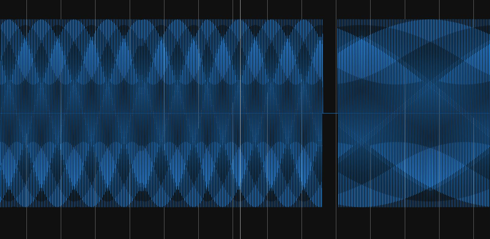

# audio-frequency-stego (108 solves, 457 points)

## Description:
What a mundane song, it's just the same note repeated over and over. But could there perhaps be two different notes?

[audio_frequency_stego.wav](audio_frequency_stego.wav)

## Solution:
The description made us think of binary, because two notes could represent 1's and 0's. Indeed, looking at the waveform we can see two distinct waves. We used [Sonic Visualizer](https://www.sonicvisualiser.org/) to create the waveform and zoom in.

The left represents a 1 and the right represents a 0. We counted these waves all the way until the end, and converted to ascii. We had to do this by hand, because we could not figure out how to parse the file correctly. 

## Flag:
`flag{sl1gh_p1tch_ch4ng3}`