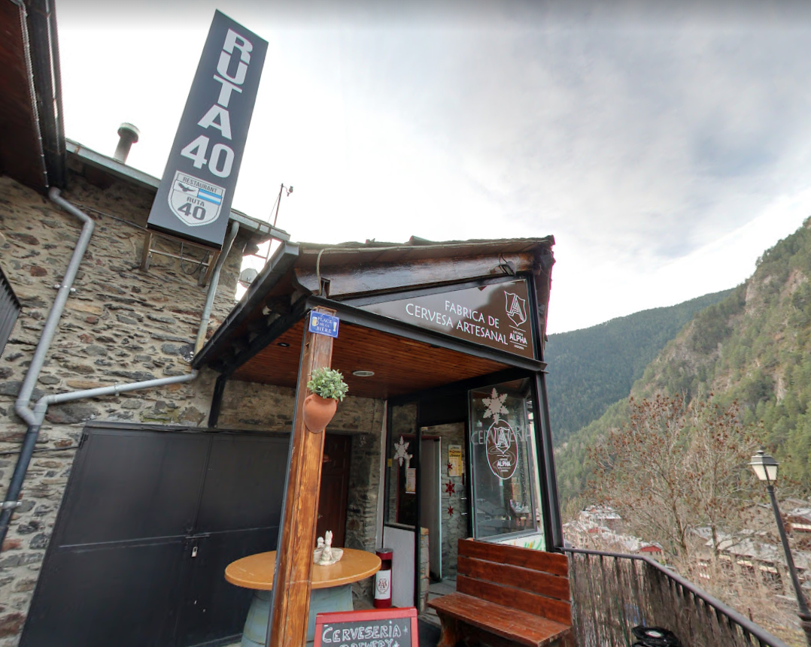
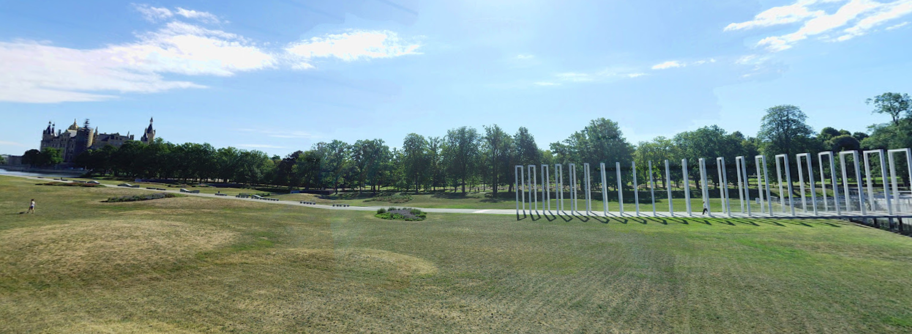
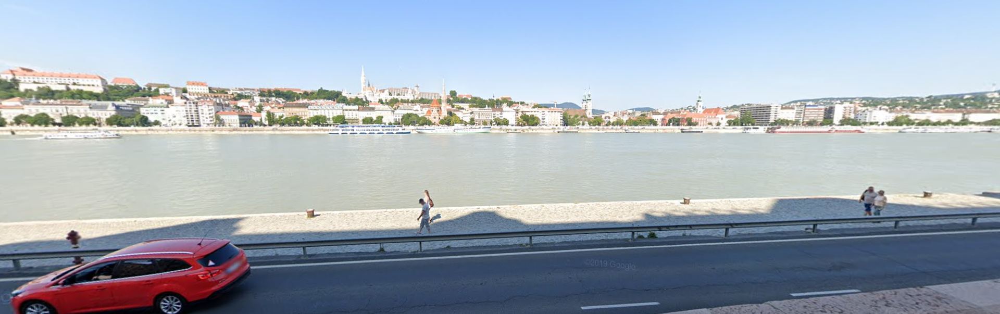
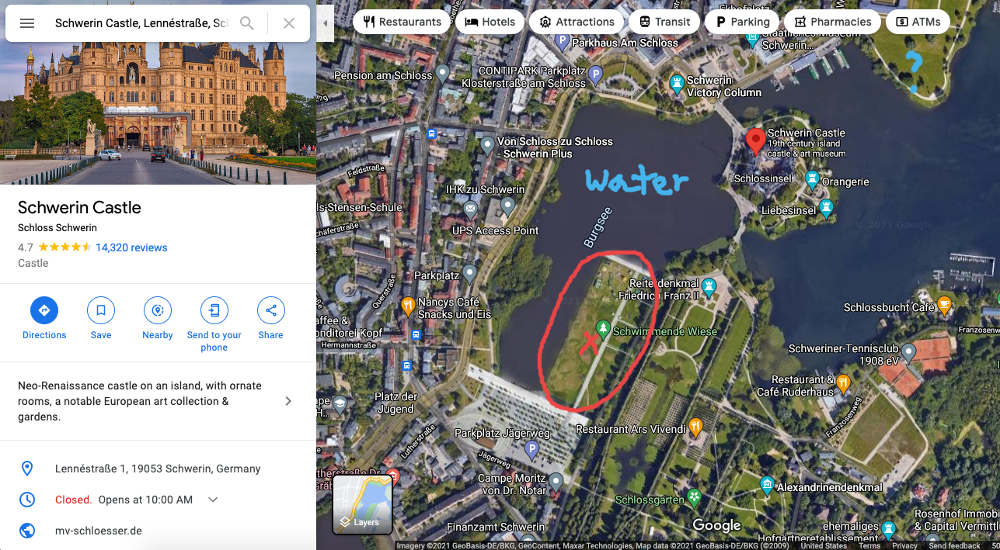
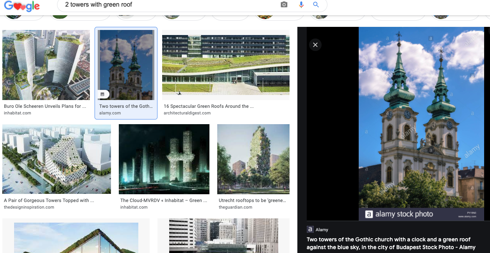

# geographic-mapping-2 (105 solves, 459 points)

## Description
Find the coordinates of each location - now with three coordinates!

Flag format: flag{picture1 latitude,picture1 longitude,picture2 latitude,picture2 longitude,picture3 latitude,picture3 longitude}, all latitudes and longitudes to the nearest THREE decimal digits after the period, except for picture 2, which should have TWO decimal digits. No spaces in the flag.

Example format: flag{12.862,48.066,-13.47,-48.37,-13.477,-48.376}. Picture 2 has two decimal digits, while the rest have 3.

The challenge author will not confirm individual locations, nor check your decimal digits. Three decimal digits gives a range of ~111 meters.

  

## Solution
Read disclosure from previous geographic challenge.

### Picture 1
We can see the name of the store, `Fabrica de Cervesa Artesanal`. Googling this, I got nothing; then, I added "alpha", which is shown to the right on the sign. Then, we get an exact location from Google Maps for the bar as shown below in `Andorra`. After some fiddling with the multiple photospheres, we get the coordinates `(42.569, 1.489)`

### Picture 2
We can see a castle, so I assumed that we're in Europe (also the general feel from experience). The main characteristics are: the golden dome on the castle, the white frame walkway, empty green flat area, and water (river/stream?). I initially searched for the white frame walkway, but then Googled the golden dome. Looking at Google Images, our top results are Castle Howard, Schwerin Castle, and Wawel Castle. Now, we can check on Google Maps; Castle Howard doesn't have the water nor the walkway, and Wawel Castle is by water but has no large green field since it's crowded in the city. Schwerin Castle (`Schwerin, Germany`) is quite promising as shown below due to the water and green areas.

We can check all the green areas around, and we find that the photosphere directly in the center of the rectangle field is the correct one, thus getting us the coordinates `(53.62, 11.41)` 

### Picture 3
Again, this looks like a major European city due to the architecture and the license plate on the car (white with blue strip). However, many cities lie on rivers, so we need some main characteristics. Zooming into the buildings across the river, I saw these 2 towers with a green roof. Googling this, we get this result as shown below pointing us to `Budapest, Hungary`. 

With some more googling to find the exact Gothic church (Matthias Church), we can find the location, and then use street view on the opposite side of the river to match up with the red car, giving us the coordinates `(47.505, 19.045)`.

## Flag
`flag{42.569,1.489,53.62,11.41,47.505,19.045}`
