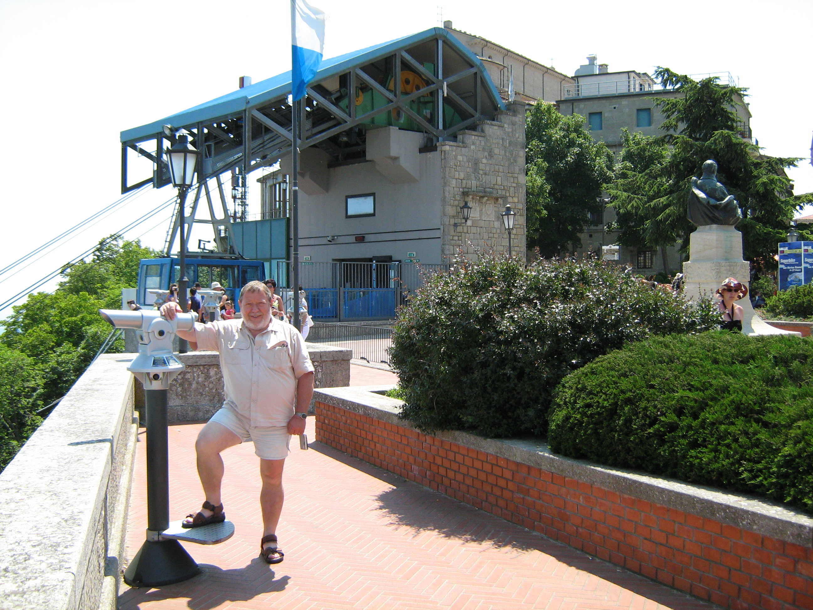

# geographic-mapping (164 solves, 429 points)

## Description
Find the coordinates of each location!

Flag format: flag{picture1 latitude,picture1 longitude,picture2 latitude,picture2 longitude}, all latitudes and longitudes to the nearest THREE decimal digits after the period. No spaces in the flag.

Example format: flag{12.862,48.066,-13.477,-48.376} The challenge author will not confirm individual locations, nor check your decimal digits. Three decimal digits gives a range of ~111 meters.

 

## Solution
Disclosure: I play Geoguessr (google if you've never heard it), so I did have a slight advantage, but these are definitely doable regardless. We can see in both that they have flags, so we can narrow the country down. 

### Picture 1
With a bit of google, we can confirm that the flag is of `Malta` (just reversed left to right). We are also given a compass in the bottom left as the picture is pulled from Geoguessr, which shows that we are looking directly North, with the water out to the East. Thus, we can narrow our search down significantly to the area below. 

Now, we just have to search using the satellite option on Google Maps; we can tell that the southern part is too empty and dry, and we also know there is a significant amount of beach next to the road, so it cannot be directly on the water. The final piece of information is that we see there is a bus stop up ahead, which Google Maps does display with a bus icon. Eventually, we find the location in Quarry's Wharf, with the coordinates `(35.898, 14.518)`

### Picture 2
Admittedly, the I initially assumed was that the flag was of `Bavaria`, which is a state in Germany; however, after much searching and thinking I realized this isn't possible as the image is from Google coverage which I know due to my Geoguessr experience, as we see a blur in the top right (Google coverage meaning Google doing the imaging instead of any random person). This is important as in Bavaria, Google only covers Munich, which is completely flat, and the image is showing a cable lift to the right, so this isn't possible. 

`San Marino` has a similar flag, although we cannot see it clearly. Now that we know the country, we can look at the surroundings; we have a cable lift, and a well developed platform decorated with plants. When we google `San Marino cable lift`, the first result is Funivia Citta. Looking at the images, we see this, which looks strikingly similar to our platform.

Now that we know the name, we can go into Google Maps and look around the area with street view until we can match it up. This gives us the coordinates `(43.938, 12.446)`. Finally, we can put these two pairs together to get the flag.

## Flag
`flag{35.898,14.518,43.938,12.446}`

