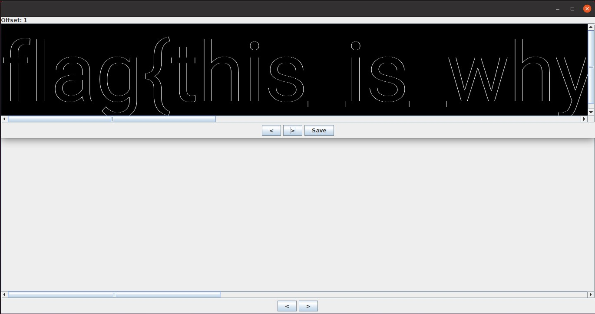

# glass-windows (359 solves, 311 points)

## Description
I found a cool glass texture.

[glass-windows.png](glass-windows.png)

## Solution
As in pallets, we can begin with the initial checks like `file, strings, exiftool, binwalk etc.` There's nothing out of the ordinary, so I decided to move onto stegsolve (by Caesum). We can test each analyze feature; stereogram solver is the first one that shows something different. When changing the offset from 0 to 1, the flag shows up as shown below.

## Flag
`flag{this_is_why_i_use_premultiplied_alpha}`

