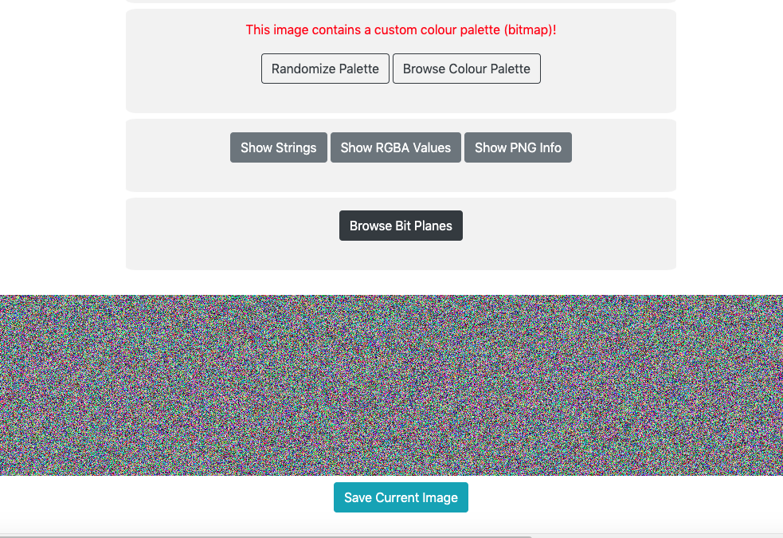

# pallets-of-gold (394 solves, 289 points)

## Description:
It doesn't really look like gold to me...

[pallets-of-gold.png](pallets-of-gold.png)

## Solution
This png just seems to be a bunch of noise, so we can begin with initial checks like `file, strings, exiftool` etc. Below is the output (abridged). 

```
Desktop pranav$ file pallets-of-gold.png
pallets-of-gold.png: PNG image data, 3191 x 227, 8-bit colormap, non-interlaced
Desktop pranav$ exiftool pallets-of-gold.png
Bit Depth                       : 8
Color Type                      : Palette
Interlace                       : Noninterlaced
Palette                         : (Binary data 768 bytes, use -b option to extract)
```

Immediately, the 8-bit colormap/palette jumps out. When I extracted this binary data however, it seemed like gibberish, so I tried using [stegonline](https://stegonline.georgeom.net/image), which is a great website to use for images like this. Once we upload the file, we're told this.



If we click browse colour pallette, the flag appears in the preview. Once we download the image, we can get the flag with a bit of guesswork for the iffy characters. (The image below looks empty, but open it a new tab and you'll see)


## Flag
`flag{plte_chunks_remind_me_of_gifs}`


