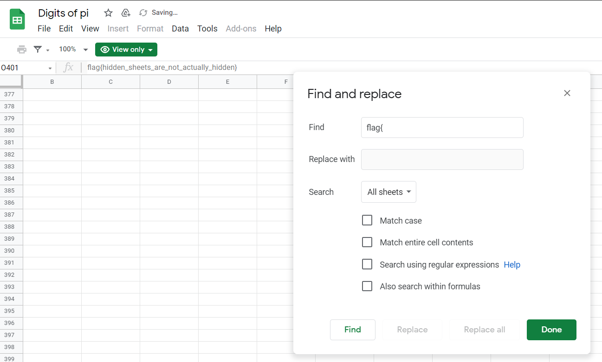

# digits-of-pi (236 solves, 388 points)

## Description:
There's more to this [spreadsheet](https://docs.google.com/spreadsheets/d/1y7AxYvBwJ1DeapnhV401w0T5HzQNIfrN1WeQFbnwbIE/edit) than meets the eye.

## Solution:
In this challenge there is a hidden sheet with the flag on it. Looking around a bit, I found the "find and replace" button and saw that it went through **all** sheets. I was able to use this to search for the flag and find it.

## Flag:
`
flag{hidden_sheets_are_not_actually_hidden}`
